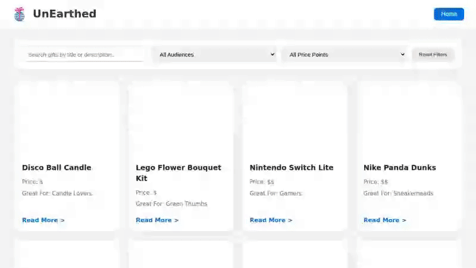

# WEB103 Unit 3 Project: UnEarthed Part 2



## Overview

UnEarthed is a full-stack gift discovery web application built with React, Node.js, Express, and PostgreSQL. It allows users to browse curated gifts, perform real-time search across names and descriptions, filter gifts dynamically by audience and price point, and navigate to individual standalone gift detail pages via custom dynamic URL routes.

---

## Technical Stack

* **Frontend**: React (Vite), React Router DOM (`react-router-dom`), Modern CSS
* **Backend**: Node.js, Express.js
* **Database**: PostgreSQL (`pg` node-postgres pool)
* **Environment Configuration**: `dotenv`

---

## Architectural Call Stack & End-to-End Traces

### 1. Project Level Architecture Diagram
High-level Client-Server-Database architecture and HTTP REST lifecycle:

```
+---------------------------------------------------------------------------------------+
|                                    CLIENT (Browser)                                   |
|  React SPA (Vite)                                                                     |
|  - Components: Header, SearchAndFilter, Card                                          |
|  - Pages: Gifts, GiftDetail, NotFound                                                 |
|  - State Management: useState, useEffect                                              |
|  - Routing: react-router-dom (BrowserRouter, Routes, Route)                           |
+------------------------------------------+--------------------------------------------+
                                           |
                                  HTTP GET Requests
                                  (e.g., /gifts?search=candle)
                                  (e.g., /gifts/1)
                                           |
                                           v
+---------------------------------------------------------------------------------------+
|                                    SERVER (Express API)                               |
|  Node.js + Express.js                                                                 |
|  - Middleware: express.static, express.json                                           |
|  - Routes: server/routes/gifts.js                                                     |
|  - Controllers: server/controllers/gifts.js                                          |
|  - DB Pool: server/config/database.js                                                 |
+------------------------------------------+--------------------------------------------+
                                           |
                                 SQL Parameterized Queries
                                 (SELECT * FROM gifts WHERE ...)
                                           |
                                           v
+---------------------------------------------------------------------------------------+
|                               DATABASE (PostgreSQL)                                   |
|  Table: gifts                                                                         |
|  Columns: id, name, pricepoint, audience, image, description, submittedby, submittedon|
+---------------------------------------------------------------------------------------+
```

---

### 2. Folder Structure Directory Mapping

Mapping showing how `client/` and `server/` interact across layers:

```
client/
  ├── index.html                  <-- Entry HTML template
  ├── src/
  │   ├── main.jsx                <-- React DOM Root Initialization
  │   ├── App.jsx                 <-- React Router routes setup (/ and /gifts/:giftId)
  │   ├── index.css               <-- Global UI styling
  │   ├── components/
  │   │   ├── Header.jsx          <-- Header navigation & logo
  │   │   ├── Card.jsx            <-- Gift card item view
  │   │   └── SearchAndFilter.jsx <-- Real-time search & filter input controls
  │   └── pages/
  │       ├── Gifts.jsx           <-- Main listing page fetching /gifts with query params
  │       ├── GiftDetail.jsx      <-- Detail page fetching /gifts/:giftId
  │       └── NotFound.jsx        <-- Fallback 404 view
  └── vite.config.js              <-- Vite build config (outputs to ../server/public)

                     │  HTTP REST API Calls / Proxy
                     ▼
server/
  ├── server.js                   <-- Express server entry point & static asset serving
  ├── config/
  │   ├── database.js             <-- pg.Pool setup reading .env config
  │   ├── dotenv.js               <-- dotenv config loading root .env
  │   └── reset.js                <-- Database reset & table seeding script
  ├── routes/
  │   └── gifts.js                <-- Express Router mapping GET / and GET /:giftId
  └── controllers/
      └── gifts.js                <-- Async controller executing SQL queries via pool.query
```

---

### 3. File Level (Class / Config / Env) Flow

Interaction between configuration files (`.env`), database pool configuration, routes, and component definitions:

```
[ .env ]
  │  (PGUSER, PGPASSWORD, PGHOST, PGPORT, PGDATABASE)
  ▼
[ server/config/dotenv.js ]
  │  Loads environment variables into process.env
  ▼
[ server/config/database.js ]
  │  Creates export const pool = new pg.Pool(config)
  ▼
[ server/controllers/gifts.js ]
  │  Imports pool to query PostgreSQL
  ▼
[ server/routes/gifts.js ]
  │  Imports GiftsController methods (getGifts, getGiftById)
  ▼
[ server/server.js ]
  │  Mounts router at app.use('/gifts', giftsRouter)
  ▼
[ client/src/pages/Gifts.jsx ] & [ client/src/pages/GiftDetail.jsx ]
     Executes fetch('/gifts?search=...') or fetch('/gifts/1')
```

---

### 4. Class & Method Level Step-by-Step Call Trace

Step-by-step method invocation sequence when filtering gifts:

1. **User Interaction**: User types "Candle" into the search input in `<SearchAndFilter />`.
2. **React State Trigger**: `onSearchChange("Candle")` triggers `setSearchTerm("Candle")` in `<Gifts />`.
3. **Hook Effect**: `useEffect` hook in `Gifts.jsx` detects `searchTerm` state change and fires `fetchGifts()`.
4. **HTTP Request**: Browser executes `fetch('/gifts?search=Candle')`.
5. **Express Server Route**: `server.js` routes matching `/gifts` path to `giftsRouter` in `server/routes/gifts.js`.
6. **Route Handler**: `giftsRouter.get('/', GiftsController.getGifts)` calls `GiftsController.getGifts(req, res)`.
7. **Controller Query Build**: `getGifts` extracts `req.query.search`, constructs parameterized query `SELECT * FROM gifts WHERE (name ILIKE $1 OR description ILIKE $1) ORDER BY id ASC` with array `['%Candle%']`.
8. **SQL Execution**: `await pool.query(selectQuery, queryParams)` executes query in PostgreSQL.
9. **Database Response**: PostgreSQL returns matching rows as JavaScript object array.
10. **HTTP Response**: Controller sends `res.status(200).json(results.rows)`.
11. **Client State Update**: React `fetchGifts` parses response `data = await response.json()` and calls `setGifts(data)`.
12. **UI Re-render**: Component re-renders, mapping `gifts` array into `<Card />` components on screen.

---

### 5. Variable Value Change Trace

Concrete variable state tracking for an item detail page request (`/gifts/3`):

| Layer / File | Variable / Parameter | Initial / Incoming Value | Computed / Output Value |
|---|---|---|---|
| **URL Address Bar** | `window.location.pathname` | `/` | `/gifts/3` |
| **React (`GiftDetail.jsx`)** | `useParams()` | `{}` | `{ giftId: "3" }` |
| **Client Fetch** | API Request Endpoint | N/A | `GET /gifts/3` |
| **Express Router** | `req.params.giftId` | String `"3"` | Passed to `GiftsController.getGiftById` |
| **Controller (`gifts.js`)** | `selectQuery` | `SELECT * FROM gifts WHERE id = $1` | Prepared SQL Query |
| **Controller (`gifts.js`)** | `[giftId]` | Array `["3"]` | Parameterized `$1` value |
| **PostgreSQL Pool** | `results.rows` | `[]` | `[{ id: 3, name: "Nintendo Switch Lite", pricepoint: "$$", audience: "Gamers", ... }]` |
| **HTTP Response** | `res.json()` payload | SQL Row Object | JSON payload `{ "id": 3, "name": "Nintendo Switch Lite", ... }` |
| **React State** | `gift` state | `null` | `{ id: 3, name: "Nintendo Switch Lite", pricepoint: "$$", ... }` |
| **DOM Tree** | `#name.textContent` | `""` | `"Nintendo Switch Lite"` |

---

## Setup & Running Locally

### 1. Database Setup
Ensure PostgreSQL is running locally, create a database named `unearthed`, and configure environment variables in `.env`:

```env
PGUSER=postgres_user
PGPASSWORD=postgres_password
PGHOST=localhost
PGPORT=5432
PGDATABASE=unearthed
PORT=3001
```

### 2. Seed Database & Start Server
```sh
cd server
npm install
npm run reset
npm start
```

### 3. Build & Run Frontend
```sh
cd client
npm install
npm run build
```

Access the app at `http://localhost:3001`.
